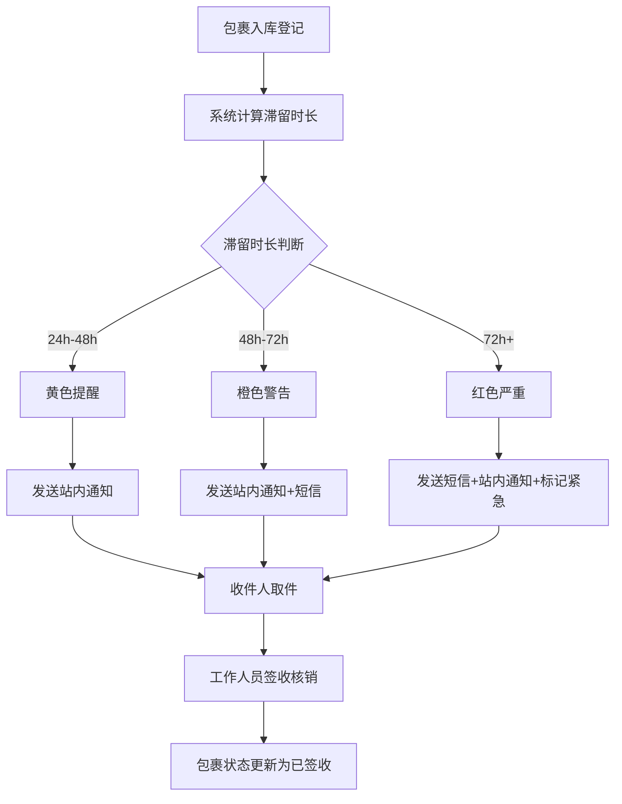

## 1. 产品概述

小区快递包裹滞留预警管理系统，面向社区代收点工作人员，实现包裹入库登记、滞留自动分级预警、通知触达、签收核销及数据统计分析的一站式管理平台。解决包裹长期滞留无人领取、代收点空间被占用、工作人员缺乏有效提醒手段等痛点问题。

## 2. 核心功能

### 2.1 用户角色

| 角色 | 进入方式 | 核心权限 |
|------|----------|----------|
| 代收点工作人员 | 账号密码登录 | 包裹入库、签收核销、预警管理、统计分析 |
| 收件人 | 手机号查询 | 查看自己的包裹状态、接收通知 |

### 2.2 功能模块

1. **工作台首页**: 今日概览统计、预警汇总、快捷操作入口、滞留趋势图
2. **包裹管理**: 包裹入库登记、包裹列表查询、包裹状态跟踪、批量导入
3. **预警中心**: 分级预警列表、预警规则配置、通知发送记录、手动触发通知
4. **签收核销**: 签收确认、取件码验证、批量签收、签收记录查询
5. **统计分析**: 滞留时长分析、预警趋势统计、代收点工作量统计、时段分布图

### 2.3 页面详情

| 页面名称 | 模块名称 | 功能描述 |
|----------|----------|----------|
| 工作台首页 | 今日概览 | 显示今日入库数、待取件数、各预警等级数量、已签收数 |
| 工作台首页 | 预警汇总 | 展示当前黄色/橙色/红色预警包裹数量及占比 |
| 工作台首页 | 快捷操作 | 包裹入库、签收核销、查看预警、统计分析快速入口 |
| 工作台首页 | 滞留趋势 | 近7天滞留包裹数量趋势折线图 |
| 包裹管理 | 入库登记 | 填写收件人姓名、电话、快递公司、快递单号、货架号，自动记录入库时间 |
| 包裹管理 | 包裹列表 | 支持按状态、预警等级、时间范围、收件人搜索筛选，显示滞留时长 |
| 包裹管理 | 包裹详情 | 查看包裹完整信息、预警记录、通知记录、签收状态 |
| 包裹管理 | 批量导入 | 通过表格模板批量导入包裹信息 |
| 预警中心 | 预警列表 | 按预警等级（黄色/橙色/红色）分类展示滞留包裹 |
| 预警中心 | 预警规则 | 配置各等级的滞留时长阈值（如24h黄色/48h橙色/72h红色） |
| 预警中心 | 通知记录 | 查看已发送的站内通知和短信通知记录及送达状态 |
| 预警中心 | 手动通知 | 对指定包裹手动触发短信或站内通知 |
| 签收核销 | 签收确认 | 输入取件码或选择包裹确认签收，记录签收时间和签收方式 |
| 签收核销 | 批量签收 | 一次确认多个包裹的签收 |
| 签收核销 | 签收记录 | 查询历史签收记录，支持按时间、收件人筛选 |
| 统计分析 | 滞留时长分析 | 各时段滞留包裹分布、平均滞留时长、最长滞留时长 |
| 统计分析 | 预警趋势 | 按日/周/月统计各预警等级包裹数量变化 |
| 统计分析 | 工作量统计 | 代收点每日入库量、签收量、通知量统计及趋势 |
| 统计分析 | 时段分布 | 包裹入库和签收的时段分布热力图 |

## 3. 核心流程

包裹入库 → 系统自动计算滞留时长 → 达到阈值触发分级预警 → 发送通知给收件人 → 收件人取件 → 工作人员签收核销 → 包裹状态更新为已签收

## 4. 用户界面设计

### 4.1 设计风格

- **主色调**: 深灰蓝(#1E293B)为底色，传达专业、可靠的系统感
- **辅助色**: 白色卡片、浅灰背景层次分明
- **预警色**: 黄色(#F59E0B)、橙色(#F97316)、红色(#EF4444)作为预警等级标识
- **成功色**: 翡翠绿(#10B981)表示已签收状态
- **按钮风格**: 圆角8px，主按钮实心填充，次按钮描边风格
- **字体**: 思源黑体(Noto Sans SC)作为主字体，数字使用等宽字体
- **布局风格**: 左侧固定导航栏 + 右侧内容区，卡片式模块布局
- **图标风格**: 线性图标(Lucide Icons)，统一2px线宽

### 4.2 页面设计概览

| 页面名称 | 模块名称 | UI元素 |
|----------|----------|--------|
| 工作台首页 | 今日概览 | 四宫格数据卡片，数字大字号加粗，图标+标签，渐变色背景 |
| 工作台首页 | 预警汇总 | 环形进度图，三色预警占比，中心总数 |
| 工作台首页 | 快捷操作 | 四个图标按钮，hover时上浮动画 |
| 工作台首页 | 滞留趋势 | 折线图，平滑曲线，区域填充渐变 |
| 包裹管理 | 入库登记 | 模态弹窗表单，输入框带图标前缀，必填项标记 |
| 包裹管理 | 包裹列表 | 表格布局，状态标签彩色胶囊，预警等级色带 |
| 预警中心 | 预警列表 | 三栏Tab切换（黄色/橙色/红色），卡片式列表 |
| 预警中心 | 通知记录 | 时间轴布局，通知类型图标区分 |
| 签收核销 | 签收确认 | 大搜索框居中，扫码/输入取件码两种方式 |
| 统计分析 | 滞留时长分析 | 柱状图+数据表格双视图 |
| 统计分析 | 工作量统计 | 堆叠面积图+日历热力图 |

### 4.3 响应式设计

- 桌面优先设计，主要在PC端使用
- 左侧导航栏在窄屏下折叠为图标模式
- 数据表格在窄屏下支持横向滚动
- 统计图表自适应容器宽度

### 4.4 动效设计

- 页面切换: 淡入淡出 200ms
- 数据卡片: 数字滚动动画
- 预警等级变化: 脉冲呼吸动画（红色预警）
- 表格行: hover时轻微上浮+阴影
- 通知发送: 发送中旋转加载，成功后打勾动画
