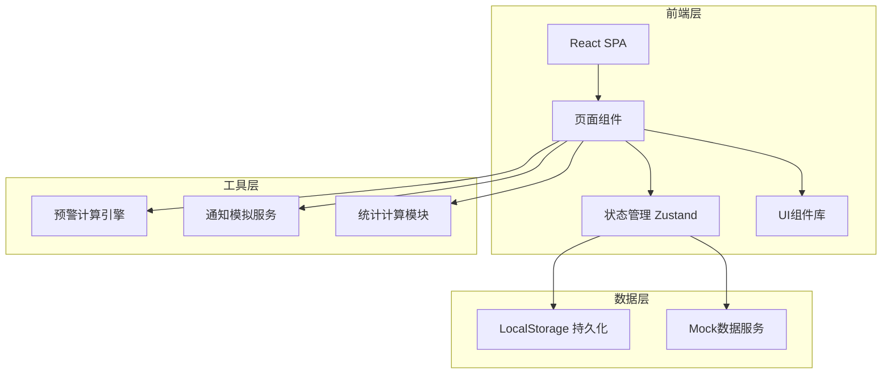
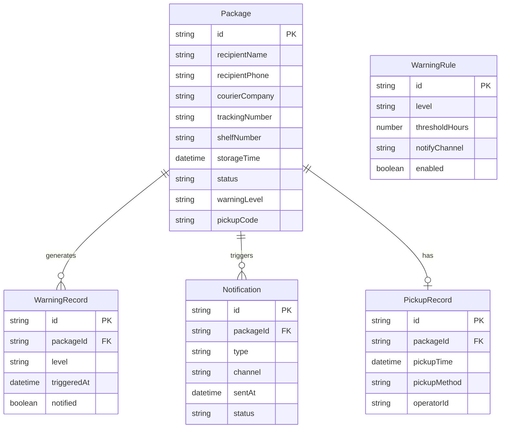

## 1. 架构设计



## 2. 技术说明

- 前端: React@18 + TypeScript + TailwindCSS@3 + Vite
- 初始化工具: Vite (react-ts 模板)
- 状态管理: Zustand (轻量级，带persist中间件实现本地持久化)
- 图表库: Recharts (React原生图表，支持折线图/柱状图/环形图/面积图)
- 图标库: Lucide React
- 后端: 无后端，使用LocalStorage + Mock数据模拟
- 日期处理: date-fns
- 动画: Framer Motion

## 3. 路由定义

| 路由 | 用途 |
|------|------|
| / | 工作台首页，展示今日概览和预警汇总 |
| /packages | 包裹管理，入库登记和包裹列表 |
| /warnings | 预警中心，分级预警列表和通知记录 |
| /pickup | 签收核销，签收确认和签收记录 |
| /statistics | 统计分析，滞留分析和工作量统计 |

## 4. 数据模型

### 4.1 数据模型定义



### 4.2 数据定义

```sql
CREATE TABLE package (
  id TEXT PRIMARY KEY,
  recipient_name TEXT NOT NULL,
  recipient_phone TEXT NOT NULL,
  courier_company TEXT NOT NULL,
  tracking_number TEXT NOT NULL,
  shelf_number TEXT,
  storage_time DATETIME NOT NULL,
  status TEXT DEFAULT 'stored',
  warning_level TEXT DEFAULT 'none',
  pickup_code TEXT
);

CREATE TABLE warning_record (
  id TEXT PRIMARY KEY,
  package_id TEXT REFERENCES package(id),
  level TEXT NOT NULL,
  triggered_at DATETIME NOT NULL,
  notified BOOLEAN DEFAULT FALSE
);

CREATE TABLE notification (
  id TEXT PRIMARY KEY,
  package_id TEXT REFERENCES package(id),
  type TEXT NOT NULL,
  channel TEXT NOT NULL,
  sent_at DATETIME NOT NULL,
  status TEXT DEFAULT 'sent'
);

CREATE TABLE pickup_record (
  id TEXT PRIMARY KEY,
  package_id TEXT REFERENCES package(id),
  pickup_time DATETIME NOT NULL,
  pickup_method TEXT NOT NULL,
  operator_id TEXT
);

CREATE TABLE warning_rule (
  id TEXT PRIMARY KEY,
  level TEXT NOT NULL,
  threshold_hours REAL NOT NULL,
  notify_channel TEXT NOT NULL,
  enabled BOOLEAN DEFAULT TRUE
);
```

## 5. 预警规则默认配置

| 预警等级 | 滞留时长阈值 | 通知方式 | 视觉标识 |
|----------|------------|----------|----------|
| 黄色提醒 | 24小时 | 站内通知 | #F59E0B 黄色标签 |
| 橙色警告 | 48小时 | 站内通知 + 短信 | #F97316 橙色标签 |
| 红色严重 | 72小时 | 短信 + 站内通知 + 紧急标记 | #EF4444 红色标签+脉冲动画 |

## 6. 关键业务逻辑

### 6.1 滞留时长计算

系统每隔1分钟（前端定时器）扫描所有"已入库"状态的包裹，计算 `当前时间 - 入库时间` 的差值，根据预警规则判定预警等级并更新包裹状态。

### 6.2 通知模拟

由于无后端服务，短信通知以模拟方式展示（Toast提示"短信已发送至138****1234"），站内通知以页面内通知列表形式呈现。

### 6.3 取件码机制

包裹入库时自动生成6位数字取件码，签收时需输入取件码验证身份后完成核销。

### 6.4 签收方式

- 取件码签收：输入6位取件码
- 手动选择签收：从列表中选择包裹直接签收
- 批量签收：勾选多个包裹一键签收
